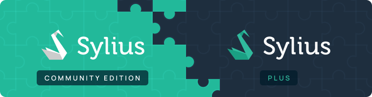

# 📖 Sylius Documentation

<figure><figcaption></figcaption></figure>

👋 Welcome to Sylius

Sylius is a headless, open-source eCommerce framework built on Symfony. It helps you build custom, scalable commerce solutions — fast. Its modular architecture is designed for flexibility and developer productivity, enabling deep customization for any business need.

Core features include customer and product management, flexible checkout and tax systems, promotional tools, and seamless integration with third-party services.

Whether you're new to Symfony or an experienced developer, Sylius grows with you—from your first product to advanced commerce workflows.

## 🧭 Choose Your Starting Point

Get hands-on with Sylius by exploring the areas below. Whether you're evaluating, installing, or building your first product, we’ve got you covered.

<table data-view="cards"><thead><tr><th align="center"></th><th align="center"></th><th align="center"></th><th data-hidden data-card-cover data-type="files"></th></tr></thead><tbody><tr><td align="center"><a href="the-book/introduction-to-sylius.md" class="button secondary" data-icon="comments-question">Introduction</a></td><td align="center"><a href="the-book/architecture/" class="button secondary" data-icon="trowel-bricks">Architecture</a></td><td align="center"><a href="the-book/sylius-plus/" class="button secondary" data-icon="plus">Sylius Plus</a></td><td><a href=".gitbook/assets/sylius-docs-about.png">sylius-docs-about.png</a></td></tr><tr><td align="center"><a href="getting-started-with-sylius/sylius-ce-installation-with-docker.md" class="button secondary" data-icon="wrench">With Docker</a></td><td align="center"><a href="the-book/sylius-ce-installation/" class="button secondary" data-icon="screwdriver-wrench">Without Docker</a></td><td align="center"><a href="https://demo.sylius.com/" class="button secondary" data-icon="window">Live Demo</a></td><td><a href=".gitbook/assets/sylius-docs-installation.png">sylius-docs-installation.png</a></td></tr><tr><td align="center"><a href="getting-started-with-sylius/choosing-sylius-when-and-why.md" class="button secondary" data-icon="scale-unbalanced-flip">Why Sylius?</a></td><td align="center"><a href="getting-started-with-sylius/before-you-begin.md" class="button secondary" data-icon="boxing-glove">Get Ready to Sylius</a></td><td align="center"><a href="getting-started-with-sylius/first-product.md" class="button secondary" data-icon="clipboard-check">Your First Product</a></td><td><a href=".gitbook/assets/sylius-docs-getting-started.png">sylius-docs-getting-started.png</a></td></tr></tbody></table>

#### Companies that trusted Sylius

<figure><figcaption></figcaption></figure>

## Sylius Plus

<figure><figcaption></figcaption></figure>

[Sylius Plus](https://sylius.com/plus/?utm_source=docs\&utm_medium=cta\&utm_campaign=plus) is a licensed edition of Sylius with advanced features and commercial support. It’s ideal for growing businesses that need stability, security, and faster scaling, with direct access to the team behind Sylius.

