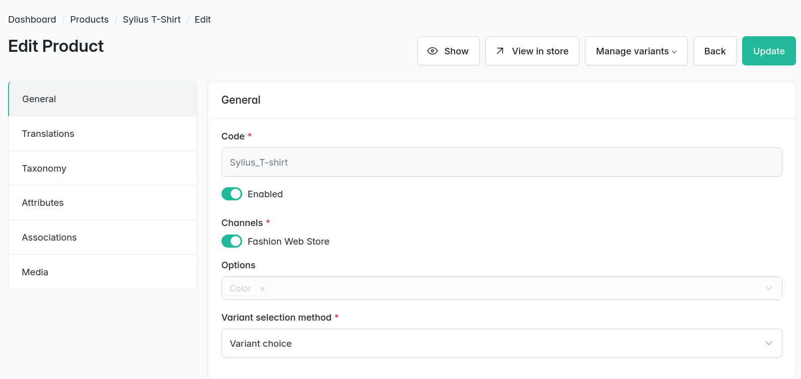

# How to customize the product show page?

This guide demonstrates how to customize a selection mechanism on the Sylius product page using a Live Component. The goal is to enhance the user experience (UX) by dynamically updating the main product image and allowing custom radio button styling for variant choices.

***

## Example Concept: “Sylius T-Shirts with different colors”

Imagine a store selling T-shirts in different colors. Each variant (color) has its own image.

* **Red** (RED-SYLIUS-TSHIRT, image: red shirt)
* **Blue** (BLUE-SYLIUS-TSHIRT, image: blue shirt)
* **Green** (GREEN-SYLIUS-TSHIRT, image: green shirt)

<figure><figcaption></figcaption></figure>

#### Configuration

* **Color options**: Red, Blue, Green
* **Variant choice selection method**

<figure><figcaption></figcaption></figure>

***

## Dynamic update of product main image

We’ll begin by creating a **Live Component** to handle the dynamic product image update.

### 1. Create a live component

```php
<?php

// src/Twig/Components/Product/ProductImagesComponent.php

declare(strict_types=1);

namespace App\Twig\Components\Product;

use Sylius\Bundle\ShopBundle\Twig\Component\Product\AddToCartFormComponent;
use Sylius\Bundle\ShopBundle\Twig\Component\Product\Trait\ProductLivePropTrait;
use Sylius\Bundle\ShopBundle\Twig\Component\Product\Trait\ProductVariantLivePropTrait;
use Sylius\Bundle\UiBundle\Twig\Component\TemplatePropTrait;
use Sylius\Component\Core\Model\ProductInterface;
use Sylius\Component\Core\Model\ProductVariantInterface;
use Sylius\Component\Core\Repository\ProductRepositoryInterface;
use Sylius\Component\Core\Repository\ProductVariantRepositoryInterface;
use Sylius\TwigHooks\LiveComponent\HookableLiveComponentTrait;
use Symfony\UX\LiveComponent\Attribute\AsLiveComponent;
use Symfony\UX\LiveComponent\Attribute\LiveArg;
use Symfony\UX\LiveComponent\Attribute\LiveListener;
use Symfony\UX\LiveComponent\ComponentToolsTrait;
use Symfony\UX\LiveComponent\DefaultActionTrait;

#[AsLiveComponent]
class ProductImagesComponent
{
    use ComponentToolsTrait;
    use DefaultActionTrait;
    use HookableLiveComponentTrait;
    use ProductLivePropTrait;
    use ProductVariantLivePropTrait;
    use TemplatePropTrait;

    /**
     * @param ProductRepositoryInterface<ProductInterface> $productRepository
     * @param ProductVariantRepositoryInterface<ProductVariantInterface> $productVariantRepository
     */
    public function __construct(
        ProductRepositoryInterface $productRepository,
        ProductVariantRepositoryInterface $productVariantRepository,
    ) {
        $this->initializeProduct($productRepository);
        $this->initializeProductVariant($productVariantRepository);
    }

    #[LiveListener(AddToCartFormComponent::SYLIUS_SHOP_VARIANT_CHANGED)]
    public function updateProductVariant(#[LiveArg] mixed $variantId): void
    {
        if (null === $variantId) {
            return;
        }

        $changedVariant = $this->productVariantRepository->find($variantId);

        if ($changedVariant === $this->variant) {
            return;
        }

        $this->variant = $changedVariant->isEnabled() ? $changedVariant : null;
    }
}
```


The `AddToCartFormComponent::SYLIUS_SHOP_VARIANT_CHANGED` is the event emitted by `Sylius\Bundle\ShopBundle\Twig\Component\Product\AddToCartFormComponent` every time the product variant is changed. This event triggers the update process for the selected variant.


### 2. Register the component

```yaml
# config/services.yaml

services:
    app.twig.component.product.images:
        class: App\Twig\Components\Product\ProductImagesComponent
        arguments:
            - '@sylius.repository.product'
            - '@sylius.repository.product_variant'
        calls:
            -   method: setLiveResponder
                arguments: [ '@ux.live_component.live_responder' ]
        tags:
            -   name: sylius.live_component.shop
                key: 'app:product:images'
        autoconfigure: false
```


We need to use `autoconfigure: false` to make our `app:product:images` visible, otherwise the default key `Product:ProductImagesComponent` will be shown.



Check if the component is correctly registered by running the following command:

```
php bin/console debug:twig-component
```



### Warning!

This live component works for both `options matching` and `variant choice` selection methods!


### 3. **Investigate the Twig Hook to Override**

Examine the main image to find the exact hook we need to attach our component to.

<figure><figcaption></figcaption></figure>

### 4.  Create template for component

```twig
{# templates/shop/product/show/content/info/overview/images/main_image.html.twig #}





    
    

    
    


<div class="col pe-lg-5 pe-xxl-5" {{ attributes }}>
    <a href="{{ original_path }}" class="d-block overflow-auto bg-light rounded-3 spotlight">
        
    </a>
</div>
```

### 5.  Update twig hook

```yaml
# config/packages/_sylius.yaml

sylius_twig_hooks:
    hooks:
        'sylius_shop.product.show.content.info.overview.images':
            main_image:
                enabled: false
            main_image_using_component:
                component: 'app:product:images'
                props:
                    product: '@=_context.product'
                    template: 'shop/product/show/content/info/overview/images/main_image.html.twig'
                priority: 0
```


We need to disable `main_image` as we cannot define the template and component at once, using here our custom `main_image_using_component` just replaces old hook with a new one.


***

## Style **the Variant Selection Method**

After setting up the Live Component, the next step is customizing how the variants are displayed and selecting them. We will use **Twig hooks** to override the default behavior and apply our custom styling.

### **1. Investigate the Twig Hooks to Override**

Before customizing the variant selection, it's important to understand the specific Twig hooks used in Sylius for the product page. These hooks allow us to override default templates and integrate custom components.

<figure><figcaption></figcaption></figure>


Learn more about twig hooks [here](https://stack.sylius.com/twig-hooks/getting-started)!


### 2. **Create Twig Templates for Variants**

Once you've identified the relevant hooks, you can proceed with customizing the variant selection by creating the following Twig templates. Lets assume we want to make this table be coloured green when checked.

```twig
{# templates/shop/product/show/content/info/summary/add_to_cart/variants/table.html.twig #}

<table {{ sylius_test_html_attribute('product-variants') }} class="table table-hover align-middle">
    
</table>
```

```twig
{# templates/shop/product/show/content/info/summary/add_to_cart/variants/table/body.html.twig #}

<tbody>
    
        
        <tr {{ sylius_test_html_attribute('product-variants-row') }}
            class="table-primary">
            
        </tr>
    
</tbody>
```

```twig
{# templates/shop/product/show/content/info/summary/add_to_cart/variants/table/body/selection.html.twig #}

<td class="align-middle">
    <div class="form-check py-2">  
        {{ form_widget(hookable_metadata.context.form.cartItem.variant[hookable_metadata.context.key], {
        'label': false,
        'attr': {
        'class': 'form-check-input',
        'data-bs-toggle': 'radio'
        }
        }) }}
    </div>
</td>
```

```twig
{# templates/shop/product/show/content/info/summary/add_to_cart/variants/table/body/name.html.twig #}




<td>
    
        <div>
            
                <div>
                    {{ option_value.value }}
                </div>
            
        </div>
    
        {{ variant.name|default(variant.descriptor) }}
    
</td>
```

### 3. Register Twig Hooks

```yaml
# config/packages/_sylius.yaml

sylius_twig_hooks:
    hooks:
        'sylius_shop.product.show.content.info.summary.add_to_cart.variants':
            table:
                template: 'shop/product/show/content/info/summary/add_to_cart/variants/table.html.twig'
                priority: 0

        'sylius_shop.product.show.content.info.summary.add_to_cart.variants.table':
            body:
                template: 'shop/product/show/content/info/summary/add_to_cart/variants/table/body.html.twig'
                priority: 0

        'sylius_shop.product.show.content.info.summary.add_to_cart.variants.table.body':
            selection:
                template: 'shop/product/show/content/info/summary/add_to_cart/variants/table/body/selection.html.twig'
                priority: 0
```

This configuration ensures that:

* The variant selection UI is rendered with the custom table and body templates.
* Name reflects only options, with fallback to variant name

***

## Result

### 1. Go to the product page for “Sylius T-Shirt”, you should see custom radios

<figure><figcaption></figcaption></figure>

### 2. Selecting a variant should **dynamically update the main product image** without reloading the page.

<figure><figcaption></figcaption></figure>
