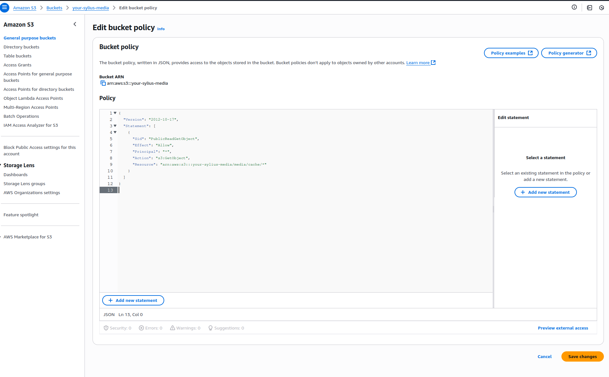

# How to automatically store images on AWS-S3?

This guide explains how to configure your Sylius 2.x store to automatically upload and store images (such as product images) on Amazon Web Services (AWS) S3.\
Using S3 storage reduces server load, improves performance, and provides scalability for your images.

### Prerequisites

Make sure you have:

* A working **Sylius 2.x** project
* An **AWS account** with S3 access
* Familiarity with Symfony configuration

***

## 1. IAM Setup & S3 Configuration

### 1.1 Create an IAM User for S3

1. Log in to the [AWS Console](https://console.aws.amazon.com/iam/)
2. Go to **IAM > Users > Add user**
3. Set the **User name**, e.g., `sylius-s3-media`
4. Enable **Programmatic access**
5. Click **Next: Permissions**
6. Choose **Attach policies directly** → click **Create policy**
7. Choose the **JSON tab** and paste:

<pre class="language-json"><code class="lang-json">{
    "Version": "2012-10-17",
    "Statement": [
        {
<strong>            "Effect": "Allow",
</strong>            "Action": [
                "s3:GetObject",
                "s3:PutObject",
                "s3:DeleteObject",
                "s3:PutObjectAcl"
            ],
            "Resource": "arn:aws:s3:::your-sylius-media/*"
        },
        {
            "Effect": "Allow",
            "Action": [
                "s3:ListBucket"
            ],
            "Resource": "arn:aws:s3:::your-sylius-media"
        }
    ]
}
</code></pre>

<figure><figcaption></figcaption></figure>

8. Name and create the policy (e.g., `SyliusS3AccessPolicy`)
9. Return to user creation → attach the policy → finish and download credentials

### 1.2 Configure your AWS CLI client


This is only needed if you want to use AWS CLI!


```bash
aws configure
```

Enter your:

* AWS Access Key ID
* AWS Secret Access Key
* Default region (e.g., `eu-west-3`)
* Default output format (e.g., `json`)


You can generate your keys on the AWS Console panel

.png>)


### 1.3 Create an S3 Bucket

After  sucessful setup of access keys you will be able to create the bucket

```bash
# Create a bucket (replace with your desired name and region)

aws s3 mb s3://your-sylius-media --region eu-west-3
```


if you prefer to do it outside of the cli, you can achieve the same using AWS Console

.png>)


### 1.4 Configure Bucket Policy (for public read access)

```json
{
    "Version": "2012-10-17",
    "Statement": [
        {
            "Sid": "PublicReadGetObject",
            "Effect": "Allow",
            "Principal": "*",
            "Action": "s3:GetObject",
            "Resource": "arn:aws:s3:::your-sylius-media/media/cache/*"
        }
    ]
}
```

<figure><figcaption></figcaption></figure>

***

## 2. Symfony & Flysystem Configuration

### Install Required Packages

```bash
co require league/flysystem-aws-s3-v3
composer require league/flysystem-bundle
```

### Add AWS env variables

Add these variables to your `.env` file:

```
# AWS S3 Configuration

AWS_ACCESS_KEY_ID=your_access_key_here
AWS_SECRET_ACCESS_KEY=your_secret_key_here
AWS_DEFAULT_REGION=eu-west-3
AWS_S3_BUCKET=your-sylius-media
```

### Configure AWS Client

Create `config/services.yaml`:

```yaml
# config/services.yaml

parameters:
    aws.s3.key: "%env(AWS_ACCESS_KEY_ID)%"
    aws.s3.secret: "%env(AWS_SECRET_ACCESS_KEY)%"
    aws.s3.bucket: "%env(AWS_S3_BUCKET)%"
    aws.s3.region: "%env(AWS_DEFAULT_REGION)%"
    aws.s3.version: "2006-03-01"

services:
    # S3 Client for Flysystem
    Aws\S3\S3Client:
        factory: [Aws\S3\S3Client, 'factory']
        arguments:
            -
                version: "%aws.s3.version%"
                region: "%aws.s3.region%"
                credentials:
                    key: "%aws.s3.key%"
                    secret: "%aws.s3.secret%"
        public: true
```

### Configure Flysystem

```yaml
# config/packages/flysystem.yaml

flysystem:
    storages:
        sylius.aws.storage:
            adapter: 'aws'
            visibility: 'public'
            options:
                client: 'Aws\S3\S3Client'
                bucket: '%env(AWS_S3_BUCKET)%'
                prefix: ''  # Important: empty prefix to avoid double prefixing
                streamReads: true

```


### Critical Note

The prefix must be empty ('') to avoid path conflicts with LiipImagine's cache\_prefix configuration.


***

## 3. LiipImagineBundle Configuration

Update `config/packages/liip_imagine.yaml`:

```yaml
liip_imagine:
    driver: "gd"
    
    # Configure Flysystem loader for S3
    loaders:
        sylius_image:
            flysystem:
                filesystem_service: 'sylius.aws.storage'
    data_loader: sylius_image
    
    # Configure S3 resolver for cache storage
    resolvers:
        flysystem_s3:
            flysystem:
                filesystem_service: 'sylius.aws.storage'
                root_url: 'https://your-sylius-media.s3.eu-north-1.amazonaws.com'
                cache_prefix: 'media/cache'
                visibility: public
    
    # Use S3 resolver for all filter sets
    cache: flysystem_s3
    
    filter_sets:
        # Example configuration for Sylius product filters
        sylius_shop_product_original:
            cache: flysystem_s3
        
        sylius_shop_product_small_thumbnail:
            format: webp
            quality: 80
            filters:
                thumbnail: { size: [150, 112], mode: outbound }
            cache: flysystem_s3
        
        sylius_shop_product_thumbnail:
            format: webp
            quality: 80
            filters:
                thumbnail: { size: [351, 468], mode: outbound }
            cache: flysystem_s3
        
        sylius_shop_product_large_thumbnail:
            format: webp
            quality: 80
            filters:
                thumbnail: { size: [800, 1200], mode: inset }
            cache: flysystem_s3

```

## 4. Testing

### Clear Cache

```bash
php bin/console cache:clear
```

### Test the configuration

Run the Sylius fixtures to check if the images are correctly loaded

```bash
php bin/console sylius:fixtures:load
```

***

## Testing the Configuration using AWS CLI

### Test S3 Upload

```bash
# Test S3 access
aws s3 ls s3://your-sylius-media/

# Test upload capability
echo "test" | aws s3 cp - s3://your-sylius-media/test.txt
aws s3 rm s3://your-sylius-media/test.txt
```

### Test Image Generation

Create a test command to verify image processing:

```php
<?php

// src/Command/TestImageCacheCommand.php

namespace App\Command;

use Liip\ImagineBundle\Imagine\Cache\CacheManager;
use Liip\ImagineBundle\Model\Binary;
use Symfony\Component\Console\Attribute\AsCommand;
use Symfony\Component\Console\Command\Command;
use Symfony\Component\Console\Input\InputInterface;
use Symfony\Component\Console\Output\OutputInterface;
#[AsCommand(name: 'app:test-image-cache')]
class TestImageCacheCommand extends Command
{
    public function __construct(private CacheManager $cacheManager)
    {
        parent::__construct();
    }
    protected function execute(InputInterface $input, OutputInterface $output): int
    {
        // Create a test image
        $img = imagecreate(100, 100);
        $white = imagecolorallocate($img, 255, 255, 255);
        $black = imagecolorallocate($img, 0, 0, 0);
        imagestring($img, 5, 30, 40, 'TEST', $black);

        ob_start();
        imagejpeg($img);
        $content = ob_get_clean();
        imagedestroy($img);

        $binary = new Binary($content, 'image/jpeg');
        $testPath = 'test/test-image.jpg';
        $filter = 'sylius_shop_product_thumbnail';

        // Store the image
        $this->cacheManager->store($binary, $testPath, $filter);
        $output->writeln('✅ Image stored successfully');

        // Check if stored
        $isStored = $this->cacheManager->isStored($testPath, $filter);
        $output->writeln($isStored ? '✅ Image verified as stored' : '❌ Image not found');

        // Get URL
        $url = $this->cacheManager->resolve($testPath, $filter);
        $output->writeln("📄 Generated URL: $url");

        return Command::SUCCESS;
    }
}

```

Run the test:

```bash
php bin/console app:test-image-cache
```

***

## Debugging Commands

```bash
# Test S3 connectivity
aws s3 ls s3://your-bucket-name/

# Check generated URLs
php bin/console liip:imagine:cache:resolve path/to/image.jpg filter_name
```

***

## Verify Your Setup <a href="#verify-your-setup" id="verify-your-setup"></a>

* Log in to your AWS console and open your S3 bucket.
* Check if the uploaded images appear under the configured folder (`media/image`).

<figure><figcaption></figcaption></figure>

***

## Troubleshooting <a href="#troubleshooting" id="troubleshooting"></a>

* **Access Denied Errors**: Ensure your IAM user has sufficient permissions (`s3:PutObject`, `s3:GetObject`, `s3:DeleteObject`). See [AWS IAM Documentation](https://docs.aws.amazon.com/IAM/latest/UserGuide/id_roles.html) for more.

<figure><figcaption></figcaption></figure>

* **Region Issues**: Confirm your bucket region matches your AWS configuration.
* **Images Not Uploading**: Ensure environment variables (`AWS_ACCESS_KEY_ID`, `AWS_SECRET_ACCESS_KEY`, `AWS_BUCKET`) are correctly defined.

***

## Further Reading <a href="#further-reading" id="further-reading"></a>

* ​[AWS S3 Documentation](https://docs.aws.amazon.com/s3/)​
* ​[Symfony Flysystem Bundle](https://flysystem.thephpleague.com/)​

Congratulations! You've successfully configured automatic image storage with AWS S3 in your Sylius application.
